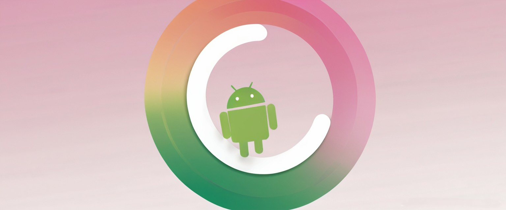
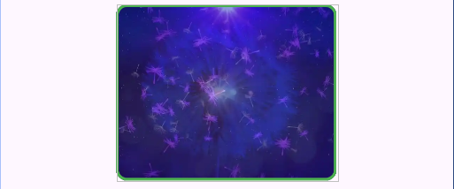
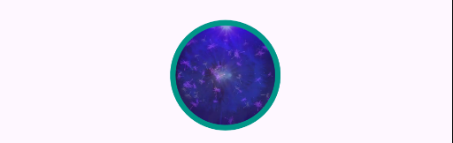

# Shapeable Views Library



A modern Android library providing customizable, shapeable versions of common UI components with
rounded corners, strokes, gradients, and more. Built with Kotlin, this library enhances your app’s
design with minimal effort.

[](https://opensource.org/licenses/Apache-2.0)
[](https://jitpack.io/#neo-turak/ShapeableView)

## Features

- **Shapeable Components**: Includes `CircleImageView`, `ShapeableImageView`, `ShapeableButton`,
  `ShapeableEditText`, and more—covering layouts like `ConstraintLayout`, `LinearLayout`, etc.
- **Customizable**: Adjust corner radii (individual or uniform), stroke width/color, gradient
  backgrounds, and solid colors.
- **Lightweight**: No heavy dependencies, pure Kotlin implementation.
- **Modern Design**: Inspired by Material Design principles, with support for dynamic updates and
  XML attributes.
- **Easy Integration**: Available via JitPack for quick setup in your Android projects.

## Components

| Component                    | Description                                     |
|------------------------------|-------------------------------------------------|
| `CircleImageView`            | Circular image view with border support         |
| `ShapeableImageView`         | Image view with rounded corners and strokes     |
| `ShapeableButton`            | Button with customizable shape and gradient     |
| `ShapeableEditText`          | EditText with rounded corners and borders       |
| `ShapeableTextView`          | TextView with shapeable background              |
| `ShapeableFrameLayout`       | FrameLayout with rounded corners                |
| `ShapeableLinearLayout`      | LinearLayout with shape customization           |
| `ShapeableConstraintLayout`  | ConstraintLayout with shapeable features        |
| `ShapeableCoordinatorLayout` | CoordinatorLayout with rounded corners          |
| `ShapeableRelativeLayout`    | RelativeLayout with shapeable background        |
| `ShapeableAppBarLayout`      | AppBarLayout with customizable shape            |
| `ShapeableNestedScrollView`  | NestedScrollView with rounded corners           |
| `ShapeableRecyclerView`      | RecyclerView with shapeable background          |
| `ShapeableView`              | Base view class for custom shapeable components |

## Installation

Add the library via JitPack to your project:

### Step 1: Add JitPack Repository

In your **root** `build.gradle.kts` (or `build.gradle`):

```kotlin
allprojects {
    repositories {
        maven { url = uri("https://jitpack.io") }
    }
}
```

### Step 2: Add Dependency

In your **app** build.gradle.kts (or build.gradle):

```groovy

dependencies {
    implementation("com.github.neoturak:view:TAG")
}

```

Replace **TAG** with the latest release version (e.g., **1.0.0**) or commit hash from GitHub. Check
the [releases page](https://github.com/neoturak/view/releases) or use **main-SNAPSHOT** for the
latest snapshot.

Sync your project, and you’re ready to go!

## Usage

### XML Example

Add a ShapeableImageView with rounded corners, stroke, and gradient:

```xml

<com.github.neoturak.view.ShapeableImageView android:id="@+id/iv_image" android:layout_width="200dp"
    android:layout_height="160dp" android:layout_marginTop="10dp" android:scaleType="centerCrop"
    app:gradient_angle="LEFT_RIGHT" app:gradient_endColor="#33E633"
    app:gradient_startColor="#220707" app:layout_constraintLeft_toLeftOf="parent"
    app:layout_constraintRight_toRightOf="parent"
    app:layout_constraintTop_toBottomOf="@id/attr_list" app:shape_cornersRadius="10dp"
    app:shape_soldColor="@color/teal_200" app:shape_strokeColor="@color/teal_700"
    app:shape_strokeWidth="5dp" app:srcCompat="@mipmap/test" />
```

### Kotlin Example

Customize a CircleImageView programmatically:

```kotlin
val circleImageView = findViewById<CircleImageView>(R.id.circle_image)
circleImageView.setBorderWidth(4)
circleImageView.setBorderColor(Color.RED)
circleImageView.setCircleBackgroundColor(Color.YELLOW)
circleImageView.setImageResource(R.mipmap.ic_launcher)
```

## Attributes(Shapeable)

| Attribute               | Description                      | Format    | Default        |
|-------------------------|----------------------------------|-----------|----------------|
| shape_cornersRadius     | Uniform corner radius            | dimension | 0dp            |
| shape_cornerTopLeft     | Top-left corner radius           | dimension | 0dp            |
| shape_cornerTopRight    | Top-right corner radius          | dimension | 0dp            |
| shape_cornerBottomLeft  | Bottom-left corner radius        | dimension | 0dp            |
| shape_cornerBottomRight | Bottom-right corner radius       | dimension | 0dp            |
| shape_strokeWidth       | Stroke width                     | dimension | 0dp            |
| shape_strokeColor       | Stroke color                     | color     | Transparent    |
| gradient_startColor     | Gradient start color             | color     | Transparent    |
| gradient_centerColor    | Gradient center color (optional) | color     | Calculated     |
| gradient_endColor       | Gradient end color               | color     | Transparent    |
| gradient_angle          | Gradient orientation (0-7)       | integer   | 6 (LEFT_RIGHT) |

the above works on all of them, except **CircleImageView**

## Attributes(CircleImageView)

| Attribute                   | Description                             | Format    | Default     |
|-----------------------------|-----------------------------------------|-----------|-------------|
| civ_border_width            | Border width (CircleImageView)          | dimension | 0dp         |
| civ_border_color            | Border color (CircleImageView)          | color     | Black       |
| civ_border_overlay          | Border overlaps image (CircleImageView) | boolean   | false       |
| civ_circle_background_color | Background color (CircleImageView)      | color     | Transparent |

I have just convert the Java file to Kotlin, lets just keep what attribute is.

## Attributes(ViewGroup)

| Attribute | Description                              | Format  | Default |
|-----------|------------------------------------------|---------|---------|
| cut_child | view group need to cut child view or not | boolean | false   |

In some occasion, the ViewGroup need to cut the child.

## Screenshots

| ShapeableImageView                        | CircleImageView                        |
|-------------------------------------------|----------------------------------------|
|  |  |

## Contributing

We welcome contributions! To contribute:

1. Fork the repository.
2. Create a feature branch (git checkout -b feature/awesome-addition).
3. Commit your changes (git commit -m "Add awesome feature").
4. Push to the branch (git push origin feature/awesome-addition).
5. Open a Pull Request.

Please follow the [Code of Conduct](CODE_OF_CONDUCT.md) and check
the [CONTRIBUTING.md](CONTRIBUTING.md) for guidelines.

## License

This library is licensed under the Apache License 2.0. See the [LICENSE](LICENSE) file for details.

```
Copyright 2025 NeoTurak

Licensed under the Apache License, Version 2.0 (the "License");
you may not use this file except in compliance with the License.
You may obtain a copy of the License at

    http://www.apache.org/licenses/LICENSE-2.0

Unless required by applicable law or agreed to in writing, software
distributed under the License is distributed on an "AS IS" BASIS,
WITHOUT WARRANTIES OR CONDITIONS OF ANY KIND, either express or implied.
See the License for the specific language governing permissions and
limitations under the License.
```

## Acknowledgments

- Inspired by [hdodenhof/CircleImageView](https://github.com/hdodenhof/CircleImageView) for the
  circular image implementation.
- Built with ❤️ for the Android developer community.